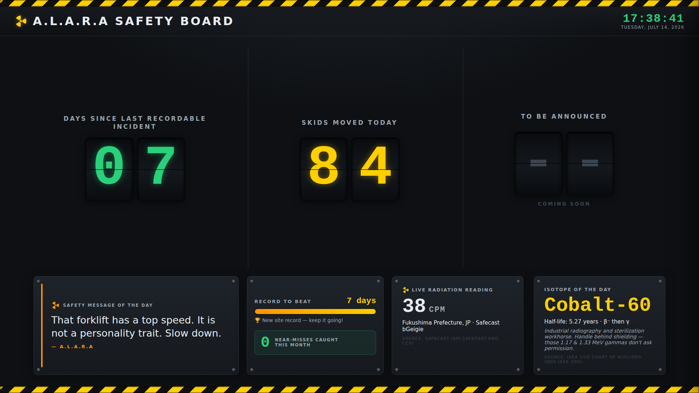

# A.L.A.R.A Safety Board

An industrial **safety-awareness dashboard** for a warehouse that handles
radioactive materials. It runs fullscreen on a wall monitor (kiosk-style) and
makes the "Days Since Last Recordable Incident" streak impossible to ignore —
with enough humor that the crew actually looks up.

Named after **ALARA** — *As Low As Reasonably Achievable* — the voice behind
the board's daily safety message.



---

## Features

- **One-screen kiosk** — the whole board is sized to exactly the viewport and
  never scrolls. It's a wall display, so there are **no on-screen buttons** to
  click; everything is driven by keypresses (see [Controls](#controls)).
- **Hero row — three headline counters** in equal columns, big industrial
  digit tiles filling the screen:
  1. **Days Since Last Recordable Incident** — **derived from a stored
     last-incident date**, so it self-corrects across reboots and ticks over at
     midnight on its own.
  2. **Skids Moved Today** — an inside-joke tally: a deterministic daily random
     (1–100), stable all day, fresh each morning at midnight.
  3. **To Be Announced** — a dim placeholder column, reserved for a third
     metric that's still being decided.
- **Safety Message of the Day** — one of A.L.A.R.A's one-liners, rotated daily.
  A slim accent bar tracks the streak (green when healthy, amber in single
  digits, red on reset) so the panel reads at a glance from across the room.
- **Report Incident · Reset** — the intentional gag. **Hold** the reset key/
  button and a "Reporting Incident…" bar fills; complete the hold and it fires
  an amber-beacon alarm + screen shake before resetting the streak to 0. A
  stray bump can't do it — release early and nothing happens.
- **Log a Near-Miss** — celebrated, not punished. A single tap bumps a monthly
  counter that auto-rolls to 0 each new month. Reporting a near-miss is a
  **catch**.
- **Record-to-beat + progress bar** and a **live clock**.
- **Settings drawer** — hidden maintenance panel (tap **S**): board name,
  last-incident date, record, near-miss count, your own A.L.A.R.A message
  lines, and the trigger-key mapping, all persisted to `localStorage` so state
  survives a reboot.
- **Daily data** — a live radiation reading (Safecast) and an "Isotope of the
  Day" (IAEA), refreshed once each morning by a scheduled script (see below).
- **Offline-proof** — no external fonts or CDNs; renders fully even if the net
  drops. Respects `prefers-reduced-motion` (kills the shake/spin/flash).

## Controls

The board face has no clickable controls — it's driven entirely by the
keyboard, so **any external button that emits a keypress** (USB foot pedal,
macropad, Arduino/GPIO-to-HID, or a plain keyboard) can drive it. Map your
button to the matching key; defaults below are configurable in the settings
drawer.

| Action                | Default | How              |
| --------------------- | ------- | ---------------- |
| Report incident/reset | `R`     | **hold** ~2s     |
| Log a near-miss       | `N`     | single tap       |
| Open settings drawer  | `S`     | single tap       |

> The reset is a *hold* (not a tap) on purpose: a physical button held down, or
> a key held for the configured seconds, is deliberate — an accidental bump
> won't wipe the streak. Not sure what hardware you'll use yet? Pick any button
> that sends a keystroke and set the keys to match; nothing in the code is tied
> to a specific device.

## Stack

- **React + Vite** → static `dist/`
- No runtime dependencies beyond React. The daily pull script is plain Node
  (18+), no npm packages.

---

## Quick start (development)

```bash
npm install
npm run dev          # http://localhost:5173
```

## Build & run on the kiosk PC

```bash
npm run build        # outputs dist/
npx serve dist       # serve over http://localhost (NOT file://)
```

Then launch the browser fullscreen/kiosk at that URL on boot, e.g.:

```bash
chromium --kiosk --app=http://localhost:3000
```

> **Why `http://localhost`, not `file://`?** Same-origin `fetch` of
> `today.json` and `localStorage` behave correctly only over a real origin.
> A `file://` page breaks both.

---

## Daily data pipeline

The board only needs one refresh a day, so we avoid browser CORS and key
exposure entirely: a **scheduled morning task** pulls the data and writes a
single same-origin JSON file. The React app just reads it.

```bash
npm run pull:today                       # writes public/today.json
# or, when serving the built board, write into the served folder:
ALARA_OUT=./dist/today.json npm run pull:today
```

**Sources**

| Data                | Source                                          | Notes                    |
| ------------------- | ----------------------------------------------- | ------------------------ |
| Radiation reading   | Safecast — `api.safecast.org/measurements.json` | CC0, no key for reads    |
| Isotope of the Day  | IAEA Live Chart of Nuclides — `nds.iaea.org`    | enriches a baked-in list |

The script is **fail-safe**: if a source is unreachable it keeps the previous
value (the board shows yesterday's, with a "cached data" note). If everything
is down it still writes valid JSON using the built-in isotope rotation, so the
board never sees broken data.

### Schedule it

**Linux/macOS (cron)** — every day at 06:00:

```cron
0 6 * * * cd /path/to/alara-safety-board && ALARA_OUT=./dist/today.json /usr/bin/node scripts/pull-today.mjs >> /var/log/alara.log 2>&1
```

**Windows (Task Scheduler)** — daily trigger at 06:00, action:

```
Program:   node
Arguments: scripts\pull-today.mjs
Start in:  C:\path\to\alara-safety-board
```

(set the `ALARA_OUT` env var to your served `today.json` path).

---

## A.L.A.R.A's brain — two phases

- **v1 (default, always on):** a baked-in bank of 50+ A.L.A.R.A one-liners in
  her voice (`src/data/alaraLines.js`). Rotates daily, works with zero network,
  literally can't break. Add your own in the Settings drawer — they merge in.
- **v2 (optional, bolt-on):** a local **Ollama** riff. Enable it in Settings.
  On the kiosk PC:

  ```bash
  ollama pull llama3.2:3b
  export OLLAMA_ORIGINS="*"   # let the browser origin reach Ollama
  # (restart the Ollama service after setting this)
  ```

  She then riffs on the day's real isotope/reading. If Ollama is down, times
  out, or isn't installed, she **falls back to the v1 bank automatically**.

---

## Design language

Industrial control-room: charcoal base, hazard-yellow/black caution-tape
accents, safety green (good) / warning red (incident) / amber beacon (alert).
Radiation trefoil, corner bolts on panels, monospace digits, wide-tracked
uppercase labels — legible from across a room.

## Project layout

```
index.html               Vite entry (inline trefoil favicon)
public/today.json        Sample daily data (so it runs standalone)
scripts/pull-today.mjs   Daily pull → today.json (cron / Task Scheduler)
src/
  App.jsx                Board layout + reset-gag orchestration
  main.jsx               React entry
  styles.css             Industrial control-room styling
  components/            HeroStat, SafetyMessage, Clock, DailyData, RecordBar,
                         Settings, Trefoil
  state/                 useBoard (localStorage), useToday, useAlaraMessage
  data/alaraLines.js     A.L.A.R.A's 50+ line bank (v1 brain)
  lib/daily.js           Deterministic daily-random (Skids Moved Today)
  lib/ollama.js          A.L.A.R.A's optional live brain (v2)
```
